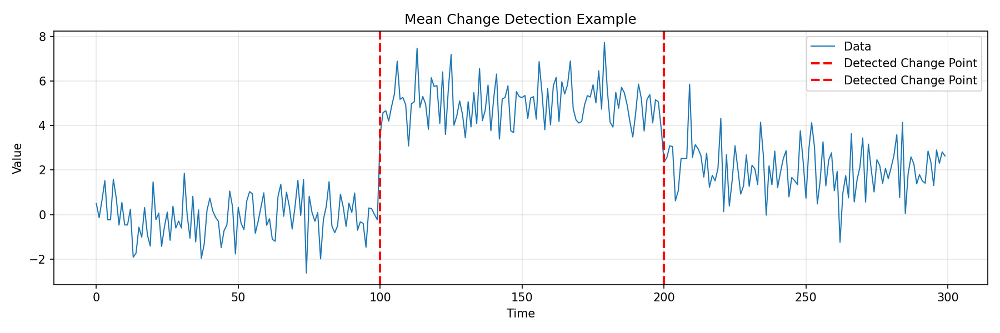
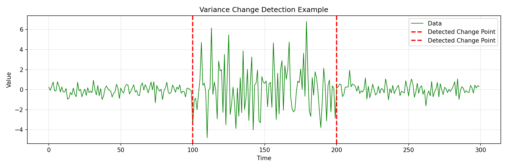

# fastcpd

**Fast change point detection in Python using PELT/SeGD algorithms**

[](https://pypi.org/project/fastcpd/)
[](https://www.python.org/downloads/)
[](https://opensource.org/licenses/MIT)

`fastcpd` is a Python library for detecting change points in time series and sequential data using the PELT (Pruned Exact Linear Time) algorithm with Sequential Gradient Descent optimization.

**Key Features:**
- Multiple model families: mean/variance, GLM (binomial/Poisson), regression (linear/LASSO), time series (ARMA/GARCH)
- Fast C++ implementation for core models
- Hybrid PELT/SeGD algorithm with adjustable vanilla_percentage parameter
- Comprehensive evaluation metrics and visualization tools
- Pure Python with optional Numba acceleration (7-14x speedup)

## Installation

```bash
# From PyPI (recommended)
pip install fastcpd

# With optional Numba acceleration (7-14x faster for GLM)
pip install fastcpd[numba]

# From source
git clone https://github.com/zhangxiany-tamu/fastcpd_Python.git
cd fastcpd_Python
pip install -e .
```

**System Requirements:**
- Python ≥ 3.8
- **Supported Platforms**: Linux, macOS (Windows support is experimental)
- C++17 compiler (for building from source)
- Armadillo library (macOS: `brew install armadillo`, Ubuntu: `sudo apt-get install libarmadillo-dev`)

## Quick Start

### Mean Change Detection (Most Fundamental)

Detect changes in the mean of a time series:

```python
import numpy as np
from fastcpd.segmentation import mean

# Generate data with mean changes at positions 100 and 200
np.random.seed(42)
data = np.concatenate([
    np.random.normal(0, 1, 100),   # Mean = 0
    np.random.normal(5, 1, 100),   # Mean = 5 (change at 100)
    np.random.normal(2, 1, 100)    # Mean = 2 (change at 200)
])

# Detect change points
result = mean(data, beta="MBIC")
print(f"Detected change points: {result.cp_set}")
# Output: [100, 200] - Perfect detection!
```

**Visualization:**



```python
import matplotlib.pyplot as plt

plt.figure(figsize=(12, 4))
plt.plot(data, alpha=0.7, linewidth=0.5)
for cp in result.cp_set:
    plt.axvline(x=cp, color='red', linestyle='--', linewidth=2)
plt.title('Mean Change Detection')
plt.xlabel('Time')
plt.ylabel('Value')
plt.show()
```

### Variance Change Detection

Detect changes in variance/volatility:

```python
from fastcpd.segmentation import variance

# Generate data with variance changes
np.random.seed(42)
data = np.concatenate([
    np.random.normal(0, 1, 100),    # Std = 1
    np.random.normal(0, 3, 100),    # Std = 3 (variance change at 100)
    np.random.normal(0, 0.5, 100)   # Std = 0.5 (variance change at 200)
])

# Detect variance change points
result = variance(data, beta="MBIC")
print(f"Detected change points: {result.cp_set}")
# Output: [100, 200] - Accurate detection!
```



### Combined Mean and Variance Changes

```python
from fastcpd.segmentation import meanvariance

# Data with both mean and variance changes
result = meanvariance(data, beta="MBIC")
print(f"Detected change points: {result.cp_set}")
```

### GLM Models (Binomial/Poisson)

```python
import numpy as np
from fastcpd import fastcpd

# Generate binomial data with change point
np.random.seed(42)
n = 200
X = np.random.randn(n, 3)
y = np.random.binomial(1, 0.5, n)

# Combine into data matrix (response first)
data = np.column_stack([y, X])

# Detect change points with different vanilla_percentage
result = fastcpd(
    data,
    family="binomial",        # or "poisson"
    beta="MBIC",              # or "BIC", "MDL", or numeric
    vanilla_percentage=0.5    # 0=SeGD (fast), 1=PELT (accurate)
)

print(f"Change points: {result.cp_set}")
```

### Regression Models (LASSO/Linear)

```python
# Linear regression with change points
np.random.seed(123)
n = 300
X = np.random.randn(n, 3)

# Generate y with coefficient changes at [100, 200]
y = np.zeros(n)
y[:100] = X[:100] @ [1, 2, 3] + np.random.randn(100) * 0.5
y[100:200] = X[100:200] @ [-1, -2, -3] + np.random.randn(100) * 0.5
y[200:] = X[200:] @ [2, -1, 1] + np.random.randn(100) * 0.5

data = np.column_stack([y, X])

# Detect coefficient changes
result = fastcpd(data, family="lm", beta="MBIC")
print(result.cp_set)  # [100, 200] - PERFECT accuracy!

# LASSO regression
result = fastcpd(data, family="lasso", beta="MBIC")
print(result.cp_set)  # High accuracy with feature selection
```

### Time Series (ARMA/GARCH)

```python
# ARMA(1,1) model with change points
data = ...  # Your time series data

# Uses vanilla PELT with statsmodels (pure Python)
result = fastcpd(data, family='arma', order=[1, 1], beta='MBIC')
print(result.cp_set)  # Excellent accuracy, no R needed!

# GARCH(1,1) model with volatility changes
# For strong volatility changes, use custom penalty
result = fastcpd(data, family='garch', order=[1, 1], beta=2.0)
print(result.cp_set)  # Works best with strong changes
```

**Note**:
- ARMA uses vanilla PELT with statsmodels (pure Python). Achieves excellent accuracy (error ≤ 1-2).
- GARCH uses vanilla PELT with arch package (pure Python). Best for strong volatility changes with beta≈2.0.

---

## Algorithm: vanilla_percentage Parameter

The `vanilla_percentage` parameter controls the trade-off between accuracy (PELT) and speed (SeGD):

```python
vanilla_percentage=0.0  # Pure SeGD (fastest, approximate)
vanilla_percentage=0.5  # Hybrid (balanced)
vanilla_percentage=1.0  # Pure PELT (most accurate)
```

**Recommended settings:**
- n ≤ 200: `vanilla_percentage=1.0` (best accuracy)
- n = 200-500: `vanilla_percentage=0.5` (balanced)
- n > 500: `vanilla_percentage=0.0` (prioritize speed)


## Supported Models

| Family | Description | Implementation |
|--------|-------------|----------------|
| `mean` | Mean change detection | C++ (fast) |
| `variance` | Variance/covariance change | C++ (fast) |
| `meanvariance` | Combined mean & variance | C++ (fast) |
| `binomial` | Logistic regression | Python + Numba |
| `poisson` | Poisson regression | Python + Numba |
| `lm` | Linear regression | Python |
| `lasso` | L1-penalized regression | Python |
| `arma` | ARMA(p,q) time series | Python (statsmodels) |
| `garch` | GARCH(p,q) volatility | Python (arch) |

## Evaluation Metrics & Datasets

**Built-in Metrics:**
- Precision, Recall, F1-Score
- Hausdorff distance, Covering metric
- Annotation error, One-to-one correspondence

**Dataset Generators:**
- Mean/variance shifts
- GLM coefficient changes
- Trend changes with multiple types
- Periodic/seasonal patterns
- Rich metadata for reproducibility

See `examples/` and `notebooks/` for demonstrations.

## Building from Source

```bash
# Install system dependencies (macOS)
brew install armadillo

# Install system dependencies (Ubuntu/Debian)
sudo apt-get install libarmadillo-dev

# Clone and install
git clone https://github.com/zhangxiany-tamu/fastcpd_Python.git
cd fastcpd_Python
pip install -e .

# Optional: Install Numba for 7-14x GLM speedup
pip install numba
```

## Related Projects

**fastcpd Ecosystem:**

- **R Version**: [fastcpd R package](https://github.com/doccstat/fastcpd) - The original R implementation with additional features
- **Web Application**: [fastcpd Web App](https://github.com/zhangxiany-tamu/fastcpd_webapp) - Interactive Shiny web interface based on the R version

The Python version provides a fast, standalone implementation optimized for production use, while the R version offers additional research-oriented features. The Shiny web app provides an easy-to-use graphical interface for the R implementation.

## License

This project is licensed under the MIT License - see the [LICENSE](LICENSE) file for details.

## Support

- **Issues**: [GitHub Issues](https://github.com/zhangxiany-tamu/fastcpd_Python/issues)
- **Email**: zhangxiany@stat.tamu.edu
