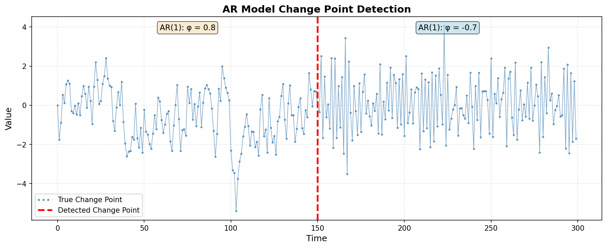

# fastcpd

**Fast change point detection in Python**

[](https://www.python.org/downloads/)
[](https://opensource.org/licenses/MIT)

A Python library for detecting change points in time series and sequential data using PELT (Pruned Exact Linear Time) and SeGD (Sequential Gradient Descent) algorithms.

**Features:**
- Parametric models: mean/variance, GLM (binomial/Poisson), linear/LASSO regression, ARMA/GARCH
- Nonparametric methods: rank-based and RBF kernel
- C++ implementation for core models, Python for specialized models
- Comprehensive evaluation metrics and dataset generators
- Optional Numba acceleration for GLM models

## Installation

**Note**: This package is not yet available on PyPI. Install from source:

```bash
# Clone repository
git clone https://github.com/zhangxiany-tamu/fastcpd_Python.git
cd fastcpd_Python

# Install with editable mode
pip install -e .

# Optional extras for examples/benchmarks/time series notebooks
# All examples and notebooks
pip install -e .[dev,test,benchmark,timeseries]

# Optional: Install Numba for 7-14x GLM speedup
pip install numba
```

**System Requirements:**
- Python ≥ 3.8
- **Supported Platforms**: Linux, macOS (Windows support is experimental)
- C++17 compiler (for building from source)
- Armadillo library (macOS: `brew install armadillo`, Ubuntu: `sudo apt-get install libarmadillo-dev`)

## Quick Start

### Mean Change Detection

```python
import numpy as np
from fastcpd.segmentation import mean

# Generate data with mean changes
np.random.seed(42)
data = np.concatenate([
    np.random.normal(0, 1, 100),
    np.random.normal(5, 1, 100),
    np.random.normal(2, 1, 100)
])

# Detect change points
result = mean(data, beta="MBIC")
print(f"Detected change points: {result.cp_set}")
# Output: [100, 200]
```

### Variance and Mean+Variance

```python
from fastcpd.segmentation import variance, meanvariance

# Variance changes only
result = variance(data, beta="MBIC")

# Both mean and variance changes
result = meanvariance(data, beta="MBIC")
```

### AR Model Change Detection

Detect changes in autoregressive model parameters:

```python
from fastcpd.segmentation import ar

# Generate AR(1) data with coefficient change
np.random.seed(100)
n = 300

# First segment: AR(1) with φ = 0.8
data1 = np.zeros(150)
for i in range(1, 150):
    data1[i] = 0.8 * data1[i-1] + np.random.normal(0, 0.8)

# Second segment: AR(1) with φ = -0.7
data2 = np.zeros(150)
for i in range(1, 150):
    data2[i] = -0.7 * data2[i-1] + np.random.normal(0, 0.8)

data = np.concatenate([data1, data2])

# Detect change points
result = ar(data, p=1, beta="MBIC")
print(f"Detected change points: {result.cp_set}")
# Output: [150]
```



### GLM and Regression Models

```python
from fastcpd import fastcpd

# Logistic regression (binomial GLM)
# Data format: first column = response, remaining = predictors
data = np.column_stack([y, X])
result = fastcpd(data, family="binomial", beta="MBIC")

# Poisson regression
result = fastcpd(data, family="poisson", beta="MBIC")

# Linear regression
result = fastcpd(data, family="lm", beta="MBIC")

# LASSO (sparse regression)
result = fastcpd(data, family="lasso", beta="MBIC")
```

### Time Series Models

```python
# ARMA(p,q) - requires statsmodels
result = fastcpd(data, family='arma', order=[1, 1], beta='MBIC')

# GARCH(p,q) - requires arch package
result = fastcpd(data, family='garch', order=[1, 1], beta=2.0)
```

### Nonparametric Methods

```python
from fastcpd.segmentation import rank, rbf

# Rank-based (distribution-free, monotonic-invariant)
result = rank(data, beta=50.0)

# RBF kernel (detects distributional changes via kernel methods)
result = rbf(data, beta=30.0)
```

## Algorithm Options

The `vanilla_percentage` parameter controls the PELT/SeGD hybrid:

```python
# For GLM models only
result = fastcpd(data, family="binomial", vanilla_percentage=0.5)
# 0.0 = pure SeGD (fast), 1.0 = pure PELT (accurate), 'auto' = adaptive
```


## Supported Models

| Family | Description | Implementation |
|--------|-------------|----------------|
| `mean` | Mean change detection | C++ (fast) |
| `variance` | Variance/covariance change | C++ (fast) |
| `meanvariance` | Combined mean & variance | C++ (fast) |
| `binomial` | Logistic regression | Python + Numba |
| `poisson` | Poisson regression | Python + Numba |
| `lm` | Linear regression | Python |
| `lasso` | L1-penalized regression | Python |
| `ar` | AR(p) autoregressive | Python |
| `var` | VAR(p) vector autoregressive | Python |
| `arma` | ARMA(p,q) time series | Python (statsmodels) |
| `garch` | GARCH(p,q) volatility | Python (arch) |
| `rank` | Rank-based (nonparametric) | Python |
| `rbf` | RBF kernel (nonparametric) | Python (RFF) |

## Evaluation Metrics & Datasets

**Built-in Metrics:**
- Precision, Recall, F1-Score
- Hausdorff distance, Covering metric
- Annotation error, One-to-one correspondence

**Dataset Generators:**
- Mean/variance shifts
- GLM coefficient changes
- Trend changes with multiple types
- Periodic/seasonal patterns
- Rich metadata for reproducibility

See `examples/` and `notebooks/` for demonstrations.

## Building from Source

```bash
# Install system dependencies (macOS)
brew install armadillo

# Install system dependencies (Ubuntu/Debian)
sudo apt-get install libarmadillo-dev

# Clone and install
git clone https://github.com/zhangxiany-tamu/fastcpd_Python.git
cd fastcpd_Python
pip install -e .

# Optional: Install Numba for 7-14x GLM speedup
pip install numba
```

## Related Projects

- [fastcpd R package](https://github.com/doccstat/fastcpd) - Original R implementation
- [fastcpd Web App](https://github.com/zhangxiany-tamu/fastcpd_webapp) - Interactive Shiny interface

## License

This project is licensed under the MIT License - see the [LICENSE](LICENSE) file for details.

## Support

- **Issues**: [GitHub Issues](https://github.com/zhangxiany-tamu/fastcpd_Python/issues)
- **Email**: zhangxiany@stat.tamu.edu
